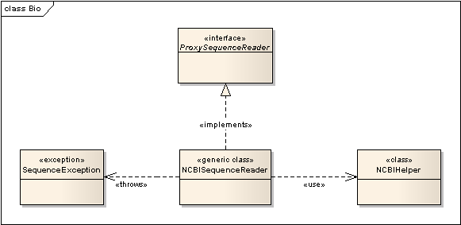

Introduction
------------

The ***NCBISequenceReader*** class, part of the biojava-core project,
retrieves data from the [NCBI](http://www.ncbi.nlm.nih.gov/) website
using the [eutils](http://eutils.ncbi.nlm.nih.gov/) via a HTTP GET
request. The SOAP interface was not pursued due to advice from other
contributors to this project.

Design Overview
---------------

The NCBISequenceReader class implements the ProxySequenceReader
interface which is in turn a subclass of the SequenceReader and Sequence
interfaces.

The NCBIHelper class performs most of the heavy lifting, connecting to
the NCBI database and building the URL as well as parsing the returning
data.

### NCBISequenceReader

This class stores only that information which is needed in order to
fulfil the interface contract and behave in line with the other classes
which implement the ProxySequenceReader interface. The implementation of
the connectivity to and interpretation of the NCBI resource is delegated
to the NCBIHelper class; which is a dependancy of this class.

The constructor takes a simple string as the only argument, this string
is the ID of the nucleotide sequence which is to be fetched.

All loading of sequence data is performed lazily at the behest of the
caller, there have with some consideration given to the minimum length a
retrieved sequence can be.

### NCBIHelper

Ideally, the NCBIHelper class would be made a more generic class which
could read from any configured URL resource but since I am only aware of
the one source at present a hard-coded solution has been provided for
the time being.

Since the NCBIHelper is connecting to a remote site using the
HttpConnection java classes there are several exceptions which can be
thrown. Additionally, there are also potential failures even if a
successful connection is made (404, 403 and invalid sequence etc). This
is currently handled internally by the class and some information logged
but it does not provide a useful mechanism to the caller about what has
happened. Is the problem fatal? Is it a timeout?

In order to return something meaningful in the case of an error a new
exception has been added to the code I have developed so far, the
SequenceException method, in the case of a fatal problem the exception
will be caught and wrapped in a SequenceException and then re-thrown
allowing the caller can catch it, and if necessary inspect it.

Design Issues
-------------

The following issues have come up during the implementation and need to
be resolved.

### Exceptions

The class inherits the methods **getSequence()** and
**getSequenceAsString(Integer start, Integer end, Strand strand)** from
the ***AbstractSequence*** since these methods need to establish a
connection to the NCBI website there are going to be times when the
connection will fail, an invalid nucleotide identifier is passed in to
the constructor or any other host of issues.

Ideally, the methods should throw a ***SequenceException*** which will
be a generic exception, wrapping any exceptions generated by the
implementing classes.

### Logging

using log4j would be very useful!

Testing
-------

The table below shows a summary of the unit tests created for the
NCBISequenceReader class.

| Test Name (method) | Description | Seed data | Requires network (Y/N) |
|--------------------|-------------|-----------|------------------------|
| Cell 1             | Cell 2      | Cell 3    | Cell 4                 |
| Cell A             | Cell B      | Cell C    |

