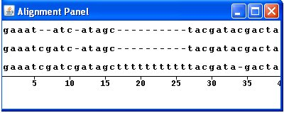

Biojava can render alignments.

The approach is to take the Sequences you want to render, and insert
them into a SimpleAlignment object. The next step is to take a
TranslatedSequencePanel and connect your Alignment to it.

What you need to do next is to setup the renderers that will render your
alignment. Start with a MultiLineRenderer. To the MultiLineRenderer you
connect one AlignmentRenderer for each sequence in the alignment. Each
AlignmentRenderer should have the label of the sequence it should render
set on it. And in the end you connect a SymbolSequenceRenderer to each
AlignmentRenderer.

So, for an Alignment with three sequences,labeled seq1,seq2 and seq3,
the renderer tree would look like this:

`                    __  AlignmentRenderer --- SymbolSequenceRenderer`  
`                   |    label=labelForSeq1`  
`                   |`  
`                   |`  
`MultilineRenderer -|--  AlignmentRenderer --- SymbolSequenceRenderer`  
`                   |    label=labelForSeq2`  
`                   |`  
`                   |__`  
`                        AlignmentRenderer --- SymbolSequenceRenderer`  
`                        label=labelForSeq3`

The following is a screenshot of the viewer generated by the
AlignmentPanel class:

<java> /\*\*

`* Class to create an alignment and then display it in a viewer.`  
`*/`

//Load Java libraries import java.awt.\*; import java.util.\*; import
javax.swing.\*;

//Load BioJava libraries import org.biojava.bio.\*; import
org.biojava.bio.seq.\*; import org.biojava.bio.seq.io.\*; import
org.biojava.bio.symbol.\*; import org.biojava.bio.gui.sequence.\*;

public class AlignmentPanel extends JFrame {

` //Create references to the sequences`  
` Sequence seq, seq1, seq2, seq3;`  
` `  
` //Instantiate the BioJava GUI elements`  
  
` //TranslatedSequencePanel `  
` TranslatedSequencePanel tsp = new TranslatedSequencePanel();`  
` //AlignmentRenderer to hold each sequence`  
` AlignmentRenderer render1, render2, render3;`  
` //MultiLinRenderer to allow display of multiple tracks in the TranslatedSequencePanel`  
` MultiLineRenderer multi = new MultiLineRenderer();`  
` //SymbolSequenceRenderer to handle display of the sequence symbols`  
` SymbolSequenceRenderer symbol = new SymbolSequenceRenderer();`  
` //RulerRenderer to display sequence coordinates`  
` RulerRenderer ruler = new RulerRenderer();`  
`   `  
` public AlignmentPanel(){`  
`   super("Alignment Panel");`

`   //Create the sequences for the alignment`  
`   try {`  
`     seq1 = DNATools.createGappedDNASequence("GAAATCGATCGATAGCTTTTTTTTTTTACGATA-GACTAGCATTCCGAC", "seq1");`  
`     seq2 = DNATools.createGappedDNASequence("GAAATCGATC-ATAGC----------TACGATACGACTAGCATTCCGAC", "seq2");`  
`     seq3 = DNATools.createGappedDNASequence("GAAAT--ATC-ATAGC----------TACGATACGACTAGCATTCCGAC", "seq3");`  
`   }`  
`   catch (BioException bioe) {`  
`     System.err.println("Bioexception: " + bioe);`  
`   }`  
` `  
`   //Add the sequences to a Map `  
`   Map`<String, Sequence>` list = new HashMap();        `  
`   list.put("1", seq1);        `  
`   list.put("2", seq2);        `  
`   list.put("3", seq3);`

`   //Use the Map to create a new SimpleAlignment`  
`   SimpleAlignment ali = new SimpleAlignment((Map) list);`  
`   `  
`   //Instantiate the renderers and set the labels and renderers`  
`   render1 = new AlignmentRenderer();`  
`   render1.setLabel(ali.getLabels().get(0));`  
`   render1.setRenderer(symbol);`

`   render2 = new AlignmentRenderer();  `  
`   render2.setLabel(ali.getLabels().get(1));`  
`   render2.setRenderer(symbol);`  
`   `  
`   render3 = new AlignmentRenderer(); `  
`   render3.setLabel(ali.getLabels().get(2));`  
`   render3.setRenderer(symbol);`  
`   `  
`   //Add the alignment renderers to the multi-line renderer`  
`   multi.addRenderer(render1);`  
`   multi.addRenderer(render2);`  
`   multi.addRenderer(render3);`  
`   multi.addRenderer(ruler);`  
`   `  
`   //Set the sequence in the TranslatedSequencePanel`  
`   tsp.setSequence((SymbolList)ali);`  
`   tsp.setOpaque(true);`  
`   tsp.setBackground(Color.white);`  
`   tsp.setRenderer(multi);  `  
`   `  
`   //Set up the display`  
`   Container con = getContentPane();`  
`   con.setLayout(new BorderLayout());`  
`   con.add(tsp, BorderLayout.CENTER);`  
`   setSize(400,200);`  
`   setLocation(100,100);`  
`   setVisible(true);  `  
` }`  
` `  
` /**`  
`  * Main method`  
`  */`  
` public static void main(String args []){`  
`   new AlignmentPanel();`  
` }`

}

</java>
