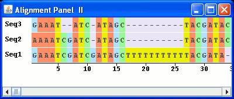

BioJava can render alignments

The AlignmentPanel\_II example builds on the AlignmentPanel class. A
scrollbar has been added to control the sequence on view. Also,
LabelledSequenceRenderers have been useed to label each sequence in the
the alignment. Lastly, the look of the sequences has been modifed.

To allow this the paint method of the SymbolSequenceRenderer class has
been overridden to allow control of the sequence being displayed. Each
nucleotide is framed in a rectangle filled with colour according to the
base.

The following is a screenshot of the viewer generated by the
AlignmentPanel\_II class:



```java //Load the Java libraries import java.awt.\*; import
java.awt.event.\*; import java.awt.geom.\*; import java.util.\*; import
javax.swing.\*; //Load the BioJava libraries import org.biojava.bio.\*;
import org.biojava.bio.seq.\*; import org.biojava.bio.seq.io.\*; import
org.biojava.bio.symbol.\*; import org.biojava.bio.gui.sequence.\*;

public class AlignmentPanel\_II extends JFrame {

` //Create references to the sequences`  
` Sequence seq, seq1, seq2, seq3;`  
  
` //Instantiate the BioJava GUI elements`  
  
` //TranslatedSequencePanel to hold the renderers `  
` TranslatedSequencePanel tsp = new TranslatedSequencePanel();`  
` //LabelledSequenceRenderer for each AlignmentRenderer`  
` LabelledSequenceRenderer labRen1, labRen2, labRen3;`  
` //AlignmentRenderer to hold each sequence`  
` AlignmentRenderer render1, render2, render3;`  
` //MultiLineRenderer to allow display of multiple tracks in the TranslatedSequencePanel`  
` MultiLineRenderer multi = new MultiLineRenderer();`  
` //SymbolSequenceRenderer to handle display of the sequence symbols - only one instance is needed`  
` SymbolSequenceRenderer symbol = new SymbolSequenceRenderer();`  
` //RulerRenderer to display sequence coordinates`  
` RulerRenderer ruler = new RulerRenderer();`  
` //The width in pixels of the of the label in the LabelledSequenceRenderer `  
` int labelWidth = 50;`  
` //The height in pixels of the of the label in the LabelledSequenceRenderer `  
` int labelHeight = 25;`

` JScrollBar scrollBar;`  
` `  
` public AlignmentPanel_II(){`  
`   super("Alignment Panel  II");`

`   //Create the sequences for the alignment`  
`   try {`  
`     seq1 = DNATools.createGappedDNASequence("GAAATCGATCGATAGCTTTTTTTTTTTACGATA-GACTAGCATTCCGACGATA-GACTAGCATTCCC", "Seq1");`  
`     seq2 = DNATools.createGappedDNASequence("AAAATCGATC-ATAGC----------TACGATACGACTAGCATTCCGAC--TA-GACTAGCATTCC-", "Seq2");`  
`     seq3 = DNATools.createGappedDNASequence("GAAAT--ATC-ATAGC----------TACGATACGACTAGCATTCCGAC--TA--ACTAGG----CC", "Seq3");`  
`   }`  
`   catch (BioException bioe) {`  
`     System.err.println("Bioexception: " + bioe);`  
`   }`  
`   `  
`   //Overide the paint method of the SymbolSequenceRenderer class to allow modification of the sequence being displayed`  
`   //To do this you will also need to modify the access level of the double depth and the Paint outline variables.`  
`   //They are private so either change that or add a get method for each.`  
`   SymbolSequenceRenderer symbol = new SymbolSequenceRenderer(){`  
`     public void paint(Graphics2D g2, SequenceRenderContext context) {`  
`       Rectangle2D prevClip = g2.getClipBounds();`  
`       AffineTransform prevTransform = g2.getTransform();`  
`       g2.setPaint(outline);`  
`       Font font = context.getFont();`  
`       Rectangle2D maxCharBounds = font.getMaxCharBounds(g2.getFontRenderContext());`  
`       double scale = context.getScale();`  
`       if (scale >= (maxCharBounds.getWidth() * 0.3) && scale >= (maxCharBounds.getHeight() * 0.3)) {`  
`         double xFontOffset = 0.0;`  
`         double yFontOffset = 0.0;`

`         xFontOffset = maxCharBounds.getCenterX() * 0.25;`  
`         yFontOffset = - maxCharBounds.getCenterY() + (depth * 0.5);`

`         SymbolList seq = context.getSymbols();`  
`         SymbolTokenization toke = null;`  
`         try {`  
`           toke = seq.getAlphabet().getTokenization("token");`  
`         } `  
`         catch (Exception ex) {`  
`           throw new BioRuntimeException(ex);`  
`         }`  
`         Location visible = GUITools.getVisibleRange(context, g2);`  
`         for (int sPos = visible.getMin(); sPos <= visible.getMax(); sPos++) {`  
`           double gPos = context.sequenceToGraphics(sPos);`  
`           String s = "?";`  
`           try {`  
`             s = toke.tokenizeSymbol(seq.symbolAt(sPos));`  
`           } `  
`           catch (Exception ex) {`  
`           // We'll ignore the case of not being able to tokenize it`  
`           }`

`           //Start of the modifications -------------------------------`  
`           //Make sure the text is uppercase`  
`           s = s.toUpperCase();`  
`           //Set the color according to the nucleotide for the background`  
`           if (s.equals("A")){g2.setColor(new Color(255,140,105));}`  
`           else if (s.equals("T")){g2.setColor(new Color(238,238,0));}`  
`           else if (s.equals("G")){g2.setColor(new Color(176,226,255));}`  
`           else if (s.equals("C")){g2.setColor(new Color(151,251,152));}`  
`           else {g2.setColor(new Color(230,230,250));}`  
`           `  
`           //Plot the rectangle to frame the nucleotide symbol`  
`           g2.fill(new Rectangle2D.Double((gPos + xFontOffset)-1.5, 0, tsp.getScale(), labelHeight ));`  
`           //Set the colour for the text`  
`           g2.setColor(new Color(83,83,83));`  
`           //End of the modifications ---------------------------------`

`           g2.drawString(s, (float)(gPos + xFontOffset), (float)yFontOffset);`  
`         }`  
`       }`  
`       g2.setTransform(prevTransform);`  
`     }`  
`   };`  
` `  
`   //Use the Map to create a new SimpleAlignment`  
`   Map`<String, Sequence>` list = new HashMap();        `  
`   list.put(seq1.getName(), seq1);        `  
`   list.put(seq2.getName(), seq2);        `  
`   list.put(seq3.getName(), seq3);`  
`   SimpleAlignment ali = new SimpleAlignment((Map) list);`

`   //Instantiate the AlignmentRenderer`  
`   render1 = new AlignmentRenderer();`  
`   //Set the label for the AlignmentRenderer`  
`   render1.setLabel(ali.getLabels().get(0));`  
`   //Set the renderer for the AlignmentRenderer`  
`   render1.setRenderer(symbol);`  
`   //Instantiate the LabelledSequenceRenderer`  
`   labRen1 = new LabelledSequenceRenderer(labelWidth, labelHeight);`  
`   //Set the name of the sequence as the label in the LabelledSequenceRenderer`  
`   labRen1.addLabelString(render1.getLabel().toString());`  
`   //Put the AlignmentRenderer in the LabelledSequenceRenderer`  
`   labRen1.setRenderer(render1);`

`   render2 = new AlignmentRenderer();  `  
`   render2.setLabel(ali.getLabels().get(1));`  
`   render2.setRenderer(symbol);`  
`   labRen2 = new LabelledSequenceRenderer(labelWidth, labelHeight);`  
`   labRen2.addLabelString(render2.getLabel().toString());`  
`   labRen2.setRenderer(render2);`  
`   `  
`   render3 = new AlignmentRenderer(); `  
`   render3.setLabel(ali.getLabels().get(2));`  
`   render3.setRenderer(symbol);`  
`   labRen3 = new LabelledSequenceRenderer(labelWidth, labelHeight);`  
`   labRen3.addLabelString(render3.getLabel().toString());`  
`   labRen3.setRenderer(render3);`

`   //Add the alignment renderers to the MultiLineRenderer`  
`   multi.addRenderer(labRen1);`  
`   multi.addRenderer(labRen2);`  
`   multi.addRenderer(labRen3);`  
`   //Add the ruler to the MultiLineRenderer`  
`   multi.addRenderer(ruler);`

`   //Set the sequence in the TranslatedSequencePanel`  
`   tsp.setSequence((SymbolList)ali);`  
`   //Set the background colour of the TranslatedSequencePanel`  
`   tsp.setOpaque(true);`  
`   tsp.setBackground(Color.white);`  
`   //Set the renderer for the TranslatedSequencePanel`  
`   tsp.setRenderer(multi);   `  
`   `  
`   //Create a scrollbar and add an adjustment listener`  
`   scrollBar = new JScrollBar(JScrollBar.HORIZONTAL, 0, 0, 0, 100);`  
`   scrollBar.addAdjustmentListener(`  
`     new AdjustmentListener() {`  
`       public void adjustmentValueChanged(AdjustmentEvent e) {`  
`         //Get the absolute position of the scroll bar`  
`         double scrollBarValue = e.getValue();`  
`         //Get the position of the scroll bar relative to the maximum value`  
`         double scrollBarRatio = scrollBarValue / scrollBar.getMaximum();`  
`         //Calculate the new position of the first base to be displayed`  
`         double pos = scrollBarRatio * (tsp.getSequence().length() - ((getWidth() - labelWidth) / tsp.getScale()));`  
`         //Set the new SymbolTranslation for the TranslatedSequencePanel`  
`         tsp.setSymbolTranslation((int)Math.round(pos));`  
`       }`  
`     } `  
`   );`  
`   `  
`   //Set up the display`  
`   Container con = getContentPane();`  
`   con.setLayout(new BorderLayout());`  
`   con.add(tsp, BorderLayout.CENTER);`  
`   con.add(scrollBar, BorderLayout.SOUTH);`  
`   setSize(400,170);`  
`   setLocation(100,100);`  
`   setVisible(true);`  
`   setDefaultCloseOperation(WindowConstants.EXIT_ON_CLOSE);`  
` }`  
` `  
` /**`  
`  * Main method`  
`  */`  
` public static void main(String args []){`  
`   new AlignmentPanel_II();`  
` }`

} ```
