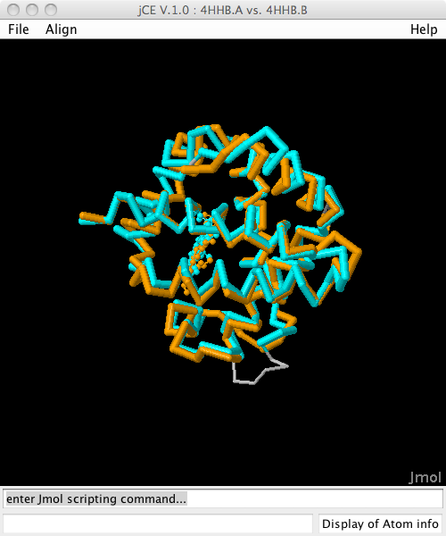

How can I calculate a structure alignment?
==========================================

Structure alignment of Hemoglobin Alpha and Beta chain ([4hhb.A vs
4hhb.B](http://www.rcsb.org/pdb/workbench/workbench.do?action=pw_ce&mol=4hhb.A&mol=4hhb.B))

### What is a structure alignment?

**Structural alignment** attempts to establish equivalences between two
or more polymer structures based on their shape and three-dimensional
conformation. In contrast to simple structural superposition (see
below), where at least some equivalent residues of the two structures
are known, structural alignment requires no *a priori* knowledge of
equivalent positions. Structural alignment is a valuable tool for the
comparison of proteins with low sequence similarity, where evolutionary
relationships between proteins cannot be easily detected by standard
sequence alignment techniques. Structural alignment can therefore be
used to imply evolutionary relationships between proteins that share
very little common sequence. However, caution should be used in using
the results as evidence for shared evolutionary ancestry because of the
possible confounding effects of convergent evolution by which multiple
unrelated amino acid sequences converge on a common tertiary structure.

For more info see the [Wikipedia article on protein structure
alignment](http://en.wikipedia.org/wiki/Structural_alignment).

### Alignment with Combinatorial Extension (CE) and FATCAT

The structure alignment possibilities of BioJava are going to be greatly
enhanced in the upcoming BioJava 3 release. It provides a BioJava port
of the **Combinatorial Extension** algorithm (CE) as well as of the
**FATCAT** algorithm. Thanks to P. Bourne, Yuzhen Ye and A. Godzik for
granting permission to freely use and redistribute their algorithms. The
documentation how to use these is available from

<BioJava:CookBook:PDB:CE_Algorithm>

<BioJava:CookBook:PDB:FATCAT_Algorithm>

[Combinatorial Extension with Circular
Permutations](Combinatorial Extension with Circular Permutations "wikilink")

### Alignment with BioJava 1.7

BioJava 1.7 contains an unpublished structure alignment algorithm. For
more information on it, please see here:

<BioJava:CookBook:PDB:BioJava_Algorithm>

### Structure superposition

Also know as "overlaying" is a process of fitting two (equivalent) sets
of Atoms onto each other. This can be useful e.g. to overlay two
different structural models of the same protein. BioJava also provides a
tool for this. (See the
[SVDSuperimposer.html](http://www.biojava.org/docs/api/org/biojava/bio/structure/SVDSuperimposer.html)
javadoc.

### Where is it being used ?

The protein structure modules of BioJava are used on the RCSB PDB web
site for the [Protein Comparison
Tool](http://www.rcsb.org/pdb/workbench/workbench.do).

### Interesting test proteins

1.  1cdg.A vs 1tim.A . A TIM barrel aligned with a **multi domain
    protein** that contains a TIM barrel. While default CE and FATCAT
    (rigid) parameters only manage to find 3/4 of the barrel aligned,
    setting the *Maximum Gap Size* parameter in CE to *unlimited* (-1)
    allows it to find the whole barrel.
    ([Example](http://www.rcsb.org/pdb/workbench/workbench.do?action=pw_ce&mol=1tim.A&mol=1cdg.A) -
    CE with default gap size)
2.  4hhb.A vs. 4hhb.B See how the visualisation tools in BioJava can
    also display a superposition of the **ligands** in an alignment.
    ([Example](http://www.rcsb.org/pdb/workbench/workbench.do?action=pw_ce&mol=4hhb.A&mol=4hhb.B))
3.  1a64.A vs. 1hng.B . Domain swapping. In this example the similarity
    between the two chains can best be found using the FATCAT-flexible
    algorithm (Compare these examples:
    [FATCAT-flexible](http://www.rcsb.org/pdb/workbench/workbench.do?action=pw_fatcat_flexible&mol=1hng.B&mol=1a64.A)
    vs.
    [CE](http://www.rcsb.org/pdb/workbench/workbench.do?action=pw_ce&mol=1HNG.B&mol=1A64.A)
4.  [1vhr.A vs
    2ihb.A](http://www.rcsb.org/pdb/workbench/showPrecalcAlignment.do?action=pw_ce_cp&pdb1=1VHR&chain1=A&pdb2=2IHB&chain2=A).
    Circular permutation. Can be detected when running CE in the
    circular permutation mode.

See Also
========

-   The BioJava Tutorial on [Structure
    Alignment](https://github.com/biojava/biojava3-tutorial/blob/master/structure/alignment.md)

