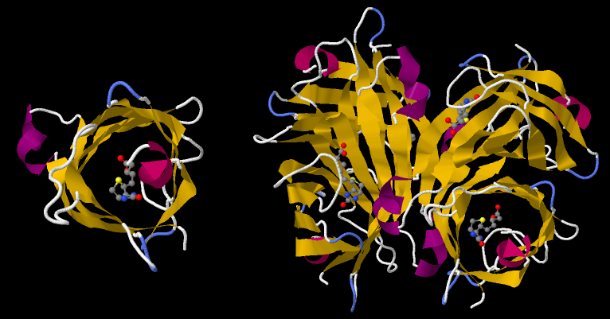

Since BioJava 3.0.5 the protein structure modules can parse the
biological assembly information out of PDB and mmcif files and create a
biologically correct representation of protein structures.

For more information about the differences between the asymmetric unit
and the biological assembly see [a tutorial at RCSB
PDB](http://www.pdb.org/pdb/101/static101.do?p=education_discussion/Looking-at-Structures/bioassembly_tutorial.html)

An comparison of the asymmetric unit and the biological assembly of
Streptavidin is shown in this screenshot: It compares the asymmetric
unit of [PDB ID
1STP](http://www.rcsb.org/pdb/explore/explore.do?structureId=1stp) (left
side) with its biological assembly (right side).



Here some example code how to load the biological assembly:

```java

           // good examples: 1stp 1gav 1hv4 1hho 7dfr 3fad  1qqp

           // assembly 0 ... asym Unit  
           // assembly 1 ... the first bio assembly  
           // example 1fah has  2 assemblies (two copies of the assembly in asymmetric unit)  
             
             
           // Various interesting symmetries: (see Lawson, 2008)  
           // Circular    - 1TJA  
           // Dihedral    - 1ei7  
           // Icosahedral - 1a34  
           // Helical     - 1cgm  
             
             
           // DNA 173D .. 2  
             
           // we load the bio assembly info out of the PDB files  
           BioUnitDataProviderFactory.setBioUnitDataProvider(BioUnitDataProviderFactory.pdbProviderClassName);

           //Structure bioAssembly = StructureIO.getBiologicalAssembly("4A1I",2);    
             
           Structure bioAssembly = StructureIO.getBiologicalAssembly("1ei7",1);  
                                     
           StructureAlignmentJmol jmolPanel = new StructureAlignmentJmol();  
           //jmolPanel.evalString("set autobond=false");  
           jmolPanel.setStructure(bioAssembly);

           // send some commands to Jmol  
           jmolPanel.evalString("select * ; color structure ; spacefill off; wireframe off; backbone off; cartoon on; select ligands ; spacefill 0.4; color cpk;");  
             
           System.out.println("done!");

```
